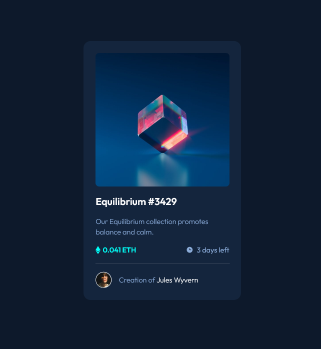

# FEM - NFT PReview Card

This is a solution to the [NFT preview card component challenge on Frontend Mentor](https://www.frontendmentor.io/challenges/nft-preview-card-component-SbdUL_w0U).

## Table of contents

- [Overview](#overview)
  - [The challenge](#the-challenge)
  - [Screenshot](#screenshot)
  - [Links](#links)
- [My process](#my-process)
  - [Built with](#built-with)
  - [What I learned](#what-i-learned)

## Overview

### The challenge

- View the optimal layout depending on their device's screen size
- See hover states for interactive elements

### Screenshot



### Links

- Solution URL: [https://github.com/chucksterv/fem-nft-preview-card-component]
- Live Site URL: [https://nft-card.projects.deshand.com]

## My process

### Built with

- Semantic HTML5 markup
- CSS custom properties
- Flexbox
- CSS Grid
- Mobile-first workflow
- SASS
- BEM

### What I learned

- Learned about the transform property and how it can be used to create cool hover effects and move things in the DOM.
- Learning about the ::before and ::after pseudo elements and how they can be used during styling.

```scss
&__img-icon {
  display: block;
  position: absolute;
  top: 50%;
  left: 50%;
  transform: translate(-50%, -50%);
  width: 100%;
  height: 100%;
  border-radius: 0.5rem;
  padding: 40%;
  background-color: clr(primary, "cyan-transparent");
  opacity: 0;
  transition: 250ms opacity ease-in-out;

  &:is(:hover, :focus) {
    cursor: pointer;
    opacity: 1;
  }
}
```

```scss
&__price {
  font-weight: $fw-bold;
  position: relative;
  margin-left: 1em;
  &::before {
    content: "";
    position: absolute;
    display: inline-block;
    width: 12px;
    height: 18px;
    background-image: url("../../images/icon-ethereum.svg");
    background-repeat: no-repeat;
    left: -16px;
    top: 3px;
  }
}
```
